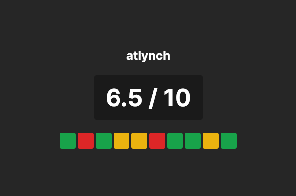

# chession
A cross-platform desktop application that tracks Lichess games played during a session, displaying wins/losses/draws with a prominent session score. Heavily inspired by Eric Rosen's Titled Tuesday score tracker.



## Features

- Session tracking with real-time game updates
- Displays username and profile information
- Tracks wins, losses, and draws for the current session
- Shows total games played during the session
- Secure token-based authentication with Lichess
- Cross-platform support (Windows, Linux, macOS)

## Getting Started

### 1. Create a Lichess API Token

To use chession, you need a Lichess API token:

1. Go to https://lichess.org/account/oauth/token/create
2. Enter a description (e.g., "chession")
3. Click "Generate Token"
4. Copy the generated token

### 2. Run the Application

Download a pre-built binary from the releases page, or run from source:

```bash
dotnet run
```

On first launch, you'll be prompted to enter your Lichess API token. The token will be securely stored for future sessions.

## Build From Source

Building from source requires the .NET 10 SDK. Use your platform and architecture to determine the appropriate runtime to build with.

```bash
# Clone the repo
git clone https://github.com/aidantlynch/chession
cd chession

# Windows
dotnet publish -c Release -r win-x64 -o ./publish/win-x64

# Linux
dotnet publish -c Release -r linux-x64 -o ./publish/linux-x64

# macOS
dotnet publish -c Release -r osx-x64 -o ./publish/osx-64
```

## Token Storage

Your Lichess API token is stored securely in the platform-specific app data directory:

- **Windows**: `%APPDATA%\chession\token.json`
- **Linux**: `~/.config/chession/token.json`
- **macOS**: `~/Library/Application Support/chession/token.json`

## Tech Stack

- Avalonia UI 11.2.2
- .NET 10
- LichessSharp (API client)

## AI Use

AI (specifically MiniMax M2.5 through OpenCode), wrote pretty much the entirety of this project. Being a professional software engineer, AI is another tool I must learn to use. This project took that idea to the extreme, or at least as far as I was willing. I still oversaw the process, read the diffs, and guided the agent when it misstepped. I still had to read through the docs for the Lichess API because although I could have the agent read them, it struggled to intuit how the API functioned in some cases. I only vaguely know Avalonia, so it undoubtedly wrote the Avalonia UI faster (and maybe better) than I could have but the agent did not deliver the 10x to 100x speed up that some claim it can.

I still can't quiet the part of myself that enjoys solving the problem and writing the code. I also can't help but feel that code has an artisanal quality to it. There were several times that I found myself needing to step in and rewrite a block of code, not because it didn't function but because it *looked off*. In the case of chession I could somewhat separate myself from these feelings. I wanted a clone of Eric Rosen's tournament score tracker without putting in the effort of creating it (although it still took considerable effort). However, I can't see myself offloading the problem solving for projects that I care about. My enjoyment of the craft comes not from the end product, but the journey that it takes to get there.
